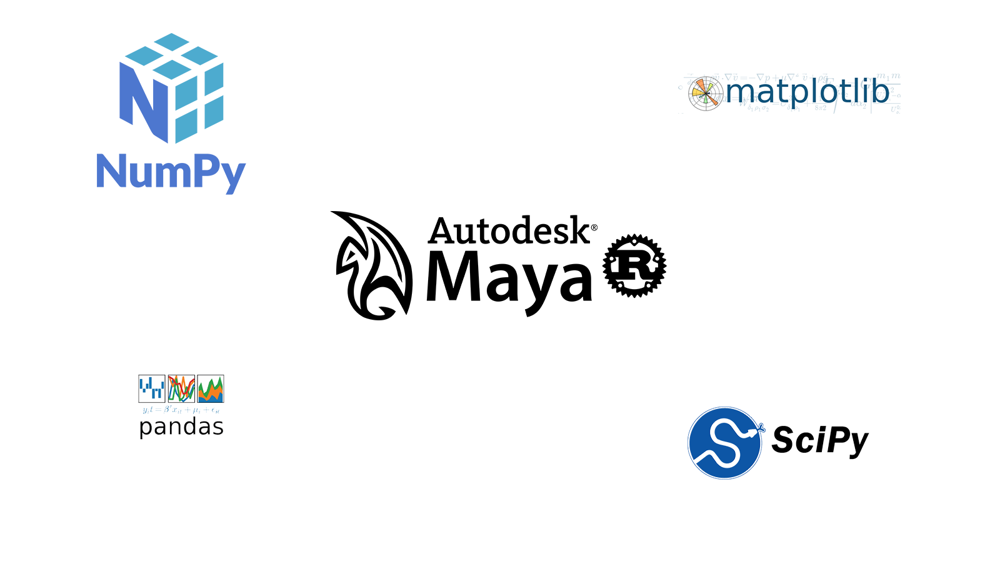

# Maya Scientific Computing Tools Installer
自动帮助你在 maya 中安装 python 的科学计算库。



## 包含的库
- pip ```20.3.4```
- cython ```0.29.22```
- numpy ```1.16.6```
- scipy ```1.2.3```
- pandas ```0.24.2```
- matplotlib ```2.2.5```

## 测试环境
- Maya 2018

## Usage
> 建议: 请依次先装好```pip``` ```cython``` ```numpy```.
```shell
install.exe MAYA_LOCATION LIBRARY_NAME
```
eg:
```shell
install.exe C:\Maya\Maya2018 numpy
```

## 下载
https://github.com/Oxygen-Technologies/Maya-Scientific-Computing-Tools-Installer/releases